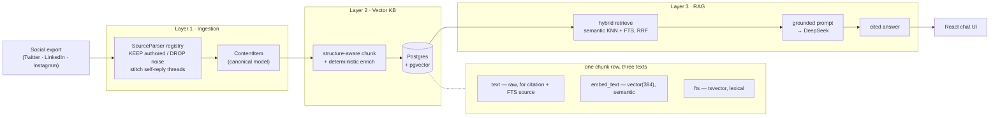

# Cortex

> **Social export → vector knowledge base → grounded chat.** Turn a personal social-media export
> into a searchable, citable knowledge base you can ask questions of — *"What does this person think
> about remote work?"* — answered with cited sources.

-brightgreen)




> **Layer 4 (efficiency) is cross-cutting:** streaming parse · batched embedding · within-run dedup ·
> cross-run vector reuse · single-transaction writes.

---

## The brief

An end-to-end system across four layers, each of which matters:

1. **Multi-source ingestion** — parse LinkedIn (CSV), Twitter/X (JSON), Instagram (JSON/HTML); keep
   authored content, discard noise. Adding a 4th source should take **under an hour**.
2. **Vector knowledge base** — chunk intelligently (not by character count), embed, and store with a
   self-designed schema that extends to new content types without a rewrite.
3. **Chat (RAG)** — a minimal UI that retrieves relevant chunks and returns a grounded answer with
   **cited sources**.
4. **Efficiency** — survive 50 MB+ exports via batching, deduplication, and incremental upserts, with
   **named tradeoffs**.

**What's shipped:** all four layers, end-to-end, on the **Twitter path**. The LinkedIn and Instagram
parsers are not built — the layers beneath them are platform-agnostic and ready for them (see
[Design Q&A](#design-questions--answers)).

| Layer | Scope | Status |
|---|---|---|
| **1 — Ingestion** | Pluggable parsers; authored-content extraction; Twitter first | ✅ Shipped |
| **2 — Vector KB** | Structure-aware chunking, local embeddings, pgvector schema | ✅ Shipped |
| **3 — Chat (RAG)** | Retrieval, grounded prompt, cited answers, UI | ✅ Shipped |
| **4 — Efficiency** | Streaming parse, batched writes, cross-run reuse, correctness invalidation | ✅ Shipped (Twitter) |

---

## Layer 1 — Ingestion

Turns a raw platform export (a folder of files) into a clean stream of canonical `ContentItem`s,
keeping what represents the person, dropping the noise, and **reporting what it dropped** so the
editorial decision is provable, not just claimed.

- **Pluggable seam** — one canonical model (`ContentItem`) + a `SourceParser` ABC + a registry.
  Adding a source = one new file + one `register()` line; nothing downstream changes.
- **Directory-root dispatch** — real exports are folders (often split across part-files), not single
  files. Parsers read account-level identity files first.
- **Explicit KEEP vs DROP** — an editorial policy backed by an ingestion report (kept / dropped /
  skipped counts + reasons) as evidence.
- **Threads stitched at parse time** — a self-reply chain becomes **one** `ContentItem` (root id as
  `external_id`) → one coherent citation.
- **Parser-owned normalization** — clean canonical text (unescape entities, strip/expand links,
  collapse whitespace, drop media-only) so downstream hashing/embedding is stable.
- **Stable `external_id` + JSONB `metadata`** — re-ingesting updates in place; per-`content_type`
  extras extend to new types without a migration.
- **Defensive** — tolerate missing fields, skip malformed/empty items (recorded), never crash on one
  bad item.

```python
@dataclass
class ContentItem:
    source_platform: str          # 'twitter' | 'linkedin' | 'instagram' | ...
    external_id: str              # stable id (root id for threads; 'profile' for bio)
    content_type: str             # 'post' | 'thread' | 'bio' | ...
    text: str                     # normalized authored text; never empty
    author_handle: str | None
    created_at: datetime | None   # tz-aware UTC
    url: str | None
    metadata: dict                # per-content_type extras → JSONB, extensible without migration
```

**Twitter KEEP vs DROP**

| KEEP (represents the person) | DROP (noise) |
|---|---|
| original tweets, stitched self-reply threads, quote-tweets with commentary, profile bio | retweets, replies to others, likes, DMs, blocks, ad/impression data |

The Twitter format was verified against the canonical community archive parser and a real June 2026
export. Quote-status link handling is validated; **retweet-shape handling is unverified** — the
audited export contained no retweets.

*Tech: Python 3.11+, standard library, `ijson` for streaming export arrays. No DB, embeddings, or
network at this layer.*

---

## Layer 2 — Vector knowledge base

Takes Layer 1's `ContentItem`s and builds the store: structure-aware chunking → deterministic
embed-input enrichment → local BGE embeddings → Postgres + pgvector with incremental, deduplicated
upserts. (Retrieval and RAG live in Layer 3; Layer 2 only provisions the search seam.)

- **One Postgres + pgvector store** for documents, chunks, JSONB metadata, FTS, and vectors — a
  production-shaped path without a separate vector database.
- **Local embeddings** — `BAAI/bge-small-en-v1.5`, 384-dim, deterministic, offline after first
  download, no hosted cost or rate limits.
- **Raw text ≠ embed text** — `*.text` stays raw for citations and FTS; `chunks.embed_text` adds
  deterministic context only for the vector. Future LLM enrichment swaps in at `build_embed_text()`
  without a schema change.
- **Structure-aware chunking** — records stay atomic by default; long stitched threads split on
  paragraph/sentence boundaries with token budgets and overlap. No character-window shredding.
- **Incremental + dedup** — a change hash skips unchanged documents entirely; identical `embed_text`
  is embedded once per run; unchanged vectors are reused across runs by `(content_hash, embed_model)`.
- **`content_type` is `TEXT`, not an enum** — new types are new strings + JSONB keys, no `ALTER TYPE`.

**Two tables.** `documents` (one row per `ContentItem`, unique on `(source_platform, external_id)`
for idempotent upsert) and `chunks` (one row per retrievable unit; FK to `documents`, `vector(384)`,
generated FTS, JSONB metadata, filter columns). Indexes: HNSW cosine over `embedding`, GIN over `fts`,
plus hash / source-type / created-at lookups.

**Three texts, two hashes — each with one job:**

| Column | Contains | Purpose |
|---|---|---|
| `documents.text` | full original authored text | citation / source display |
| `documents.content_hash` | `sha256(text + platform + type + date + enrichment ctx)` | document-level change detection |
| `chunks.text` | raw chunk slice | matched-passage display + FTS source |
| `chunks.embed_text` | deterministic context prefix + raw chunk | passage embedding input |
| `chunks.content_hash` | `sha256(embed_text)` | within-run dedup + cross-run vector reuse key |
| `chunks.fts` | generated `tsvector` from raw chunk | lexical / hybrid search |
| `chunks.embedding` | `vector(384)` from BGE | semantic search |

On the bundled Twitter fixture a clean run inserts **58 documents / 60 chunks** (the two extra chunks
are long stitched threads `2300` and `2400`). Re-running reports **58 unchanged skipped, 0 embedded**.
The CLI returns an `IndexReport` with new/updated/skipped, chunks inserted/embedded/reused/deduped,
batch count, and durations.

*Tech: `sentence-transformers`, `psycopg 3`, `pgvector`, Postgres 16, `numpy`, `pydantic-settings`.*

---

## Layer 3 — Chat (RAG)

A single-turn grounded path: query embedding → retrieval → citation join → grounded prompt →
DeepSeek → cited answer → React UI.

- **Single-turn** — `/chat` answers one question; multi-turn, query rewriting, reranking, and MMR are
  deferred to keep the slice reliable.
- **Hybrid default** — semantic KNN + Postgres FTS fused with Reciprocal Rank Fusion. On by default:
  it didn't regress the fixture and should give better lexical coverage on real exports.
- **BGE query instruction on queries only** — passages stay as Layer 2 wrote them; queries prepend
  `Represent this sentence for searching relevant passages:`.
- **Document-level citations** — retrieval starts from chunks, then joins to `documents` for `url`,
  `external_id`, `author_handle`, and full text. Multiple chunks from one document collapse to one
  source. The LLM gets full document text under `chat_context_char_cap`, else the matched chunk.
- **Citations enforced** — if sources exist and the answer has no valid `[n]` markers, the
  non-streaming API retries once with a citation nudge; the response carries `grounded` and per-source
  `cited` flags.
- **DeepSeek via OpenAI SDK** — `deepseek-v4-flash`, thinking disabled, low temperature for grounded
  fidelity over creative phrasing.

**API.** `POST /chat` returns complete JSON. `POST /chat/stream` takes the same body and returns SSE:
`token` events while writing, then a final `sources` event (full schema), then `done`. The streaming
endpoint can't retract sent text, so it reports the final `grounded` flag honestly rather than
retrying.

```json
// POST /chat  →
{
  "answer": "They value async communication for deep work [2].",
  "sources": [{
    "index": 2, "external_id": "1001", "platform": "twitter", "content_type": "thread",
    "url": "https://twitter.com/cortex_demo/status/1001", "author_handle": "cortex_demo",
    "date": "2024-05-15", "snippet": "Some hard-won thoughts on remote work, a thread...",
    "score": 0.7309, "cited": true
  }],
  "abstained": false, "grounded": true
}
```

**Eval is a sanity check, not a benchmark.** `eval/retrieval_eval.py` verifies semantic and hybrid
both find the expected documents. The fixture is too small/clean to show a hybrid quality lift —
paraphrase queries mostly collapsed hybrid to semantic-only (`websearch_to_tsquery` is strict on
unmatched terms), and semantic already ranked exact-token targets at `#1`. A real eval needs
lexical-hard queries where semantic misses, rare handles/hashtags, and FTS query preprocessing before
any quality claim.

---

## Layer 4 — Efficiency

Most levers were paid for in Layers 1–2 (batched embedding, within-run dedup, unchanged-document
skips, idempotent upserts). Layer 4 adds the rest plus a seeded stress harness that measures the
throughput and flat-memory claims.

| Mechanism | Effect |
|---|---|
| Streaming Twitter row parsing | never materializes the raw file and full decoded row list at once |
| Single-transaction writes | removes one commit per changed document; keeps `executemany` chunk inserts |
| Same-model cross-run vector reuse | reuses unchanged chunk vectors from changed documents by `(content_hash, embed_model)` |
| Enrichment-context invalidation | change hash includes enrichment context, so a bio edit correctly reprocesses dependents |

**Memory model.** Streaming removes the raw file and parsed-row list from retained state, but memory
is still `O(unique valid tweet ids) + O(authored content)` — the parser keeps the dedup id set and
authored records for thread stitching. So it is **flat with respect to file size, bounded by authored
count — not constant memory.** The embed/write phase holds pending chunks and Python `list[float]`
vectors to preserve batch efficiency, which costs materially more RAM than the compact `float32`
representation.

### Measured numbers

Illustrative, not a benchmark — figures are machine-relative. The harness (`eval/bench.py`) builds a
seeded synthetic archive, runs the real pipeline against an isolated `cortex_bench` DB (truncated
first so reuse can't fake throughput), and prints these. Reproduce with `python -m eval.bench`.

| Measurement | Value | Notes |
|---|---|---|
| Embed throughput | **382 chunks/s** | CPU, `bge-small-en-v1.5`, batch 64 |
| End-to-end ingest (~10k chunks) | **43.5 s** (229 chunks/s) | parse + chunk + embed + write |
| Throughput-path peak RSS (Δ over model) | **140 MB** | the `list[float]` vector cost — **not** the 15 MB `float32` size |
| Re-ingest same export | **0 embedded, 0 batches** | 9,957 documents skipped (incremental) |
| Peak parse RSS @ 5 / 25 / 50 MB | **27.2 / 33.2 / 41.9 MB** | roughly flat — streaming drops noise |
| Machine | Apple Silicon (arm64), 10 cores, 16 GB | numbers are machine-relative |

**Keystone:** a 10× growth in raw tweet-file size (5 → 50 MB) yields only ~1.5× growth in peak parse
RSS — the residual is the `O(unique valid tweet ids)` term. A real June 2026 export (48.7 MB archive,
but only 72,964 parser-relevant bytes) parsed in ~0.03 s at ~22.5 MB RSS into 21 kept items: this
proves real-export **compatibility**, not 50 MB tweet-file scalability.

**Concurrency was considered and intentionally not added:** multiprocessing embedding (each worker
reloads the ~400 MB model — substantial memory for an unmeasured gain; torch already parallelizes
intra-op), embed/write pipeline overlap (embedding dominates ≈26 s of the ≈43 s run; build overlap
only if writes are shown material), parallel file reads, and HNSW drop/rebuild. Each is gated on
measured need.

---

## Design questions & answers

### What does the system do, and what are the two or three most important architecture decisions?

Cortex turns a personal export into a citable knowledge base: ingest a folder → keep what represents
the person → chunk, embed, and store in Postgres + pgvector → answer questions with a grounded,
source-cited RAG answer in a small React UI. Three decisions carried the most weight, one per axis:

1. **A single canonical `ContentItem` behind a pluggable `SourceParser` registry.** Every parser
   emits the same shape, so a new source is one file + one `register()` line and nothing downstream
   changes — that is what makes *"a 4th source under an hour"* a real property, and why Twitter-only
   today doesn't imply a rewrite tomorrow.
2. **One Postgres + pgvector store with a deliberately separated schema.** Raw `text` (citation) ≠
   `embed_text` (semantic) ≠ `fts` (lexical) — three texts, two hashes, each one job — and
   `content_type` is `TEXT`, never an enum, so new types need no migration. One relational store gives
   documents, vectors, full-text, and metadata filters without a second database.
3. **Local `bge-small-en-v1.5` embeddings — forced by constraint, not taste.** No OpenAI/Anthropic key
   exists here and DeepSeek is chat-only with no embeddings endpoint, so a local model is the *only*
   viable embedder. It also happens to be $0, offline, and rate-limit-free, at a real quality cost
   versus a hosted model.

### Where is the bottleneck at 10× data volume? What breaks first?

Assume 10× *authored* content (~100k chunks) — raw-file size is mostly noise that streams away. The
order is **embedding compute → vector-holding RAM → (only much later) the store.** At ~382 chunks/s on
one CPU, embedding already dominates ingest (~26 s of a ~43 s run at 10k); 100k is ~4–5 minutes of
pure CPU embedding — the time bottleneck, and exactly the lever Layer 4 deferred. The first thing to
actually *break* (not just slow) is memory: ~140 MB of `list[float]` vectors at 10k → ~1.4 GB at 100k;
the fix is `float32` numpy arrays plus batched/streamed writes. **Postgres/pgvector does not break
first** — 100k rows in HNSW is unremarkable and `executemany` inserts are seconds. Ruling the DB out is
most of the judgment here.

### What did you consciously cut to stay in the window, and what would you build next?

The largest deliberate cut is **multi-source breadth — only Twitter ships.** The seam, schema,
chunking, RAG, and efficiency work are all source-agnostic, but the LinkedIn (CSV) and Instagram
(JSON/HTML) parsers aren't built — one *vertical* slice proven end-to-end (ingest → KB → cited chat →
measured efficiency) shows more judgment than three shallow ingestion paths. Within layers I also cut
and named: cross-encoder reranking and MMR; multi-turn and query rewriting; LLM enrichment of short
posts (the seam is built but left OFF to keep ingestion offline and deterministic); and retweet-shape
validation (flagged — the audited export had no retweets).

**Next:** the LinkedIn and Instagram parsers (they close the brief and the seam makes them cheap),
then **selective LLM enrichment for short, context-poor posts** — the single biggest answer-quality
knob, deferred only because it adds per-post network calls and non-determinism to ingestion. The
`future.txt` backlog follows: **time-based ranking** (current views represent a person more than old
ones), **likes as a signal** (what someone endorses also defines them), and **image analysis** (so
visual posts stop being dropped as empty). Each is additive at an existing seam — a scoring term, a
new `content_type`, a parser branch — not a rewrite.

### If you had to make this architecture 10× better (rethink it, not iterate)?

Iteration would be "bigger embedding model, add a reranker" — same machine, not what's asked. The
genuine rethink is to stop treating the person as a **bag of chunks ranked by cosine similarity** and
start treating them as a **structured set of claims and positions.** Top-k nearest passages is fragile
exactly where it matters: it can't aggregate a view expressed across ten posts over two years, can't
weigh a 2026 opinion over a 2019 one, and can't say "they changed their mind." A 10× system runs an
offline LLM extraction pass over the authored corpus to build a **person-centric knowledge layer** —
topics, stances, and timestamped evidence as structured rows or a small graph — so a question becomes
a *synthesis* over a stance ("here's what they think about X, with citations, and how it shifted")
rather than a similarity lookup, and retrieval becomes agentic and multi-hop. This moves the
intelligence from query time to a richer ingestion-time model of the person — which is the actual
product. The honest cost: extraction is expensive, non-deterministic, and needs its own eval harness —
the very properties deliberately kept *out* of the current path to keep it cheap, offline, and
provable in the time window.

---

## Getting started

> **Prerequisites:** **Docker** (database + backend) and **Node 18+** (frontend). Python **3.11+** is
> only needed to run the test suite on the host.

```bash
# optional: add a DeepSeek key for generated answers
# (retrieval + cited sources work without it; chat returns 503 until a key is set)
cp .env.example .env        # then edit DEEPSEEK_API_KEY=...

docker compose up           # Postgres + API together
cd frontend && npm install && npm run dev   # React UI in another shell

docker compose down         # stop; indexed data persists in the pgdata volume
```

Open the URL Vite prints (typically <http://localhost:5173>); it proxies `/chat` and `/health` to the
API on `:8000`. The **first** `docker compose up` is the only slow run — it builds the image,
downloads the BGE model into the `hfcache` volume, and auto-seeds the bundled Twitter fixture once.
Later runs reuse all three and skip embedding entirely. Use `--build` after dependency changes;
`down -v` to wipe and re-seed from scratch.

### Testing

Tests run on the host against the Postgres from `docker compose up`.

> **Heads-up:** the integration tier `TRUNCATE`s `chunks`/`documents`, wiping the auto-seeded demo
> data. Run `docker compose restart api` afterward to re-seed.

```bash
pip install -e ".[dev]"                      # package + test extras

pytest -m "not integration and not live"     # pure tier — no DB, no model download
pytest -m "integration and not live"         # real pgvector + real BGE (LLM faked)
pytest -m live                               # optional live DeepSeek smoke test (needs key)

python eval/retrieval_eval.py                # retrieval eval that decides the hybrid default

psql "$DATABASE_URL" -c 'CREATE DATABASE cortex_bench'   # one-time for the bench
python -m eval.bench                         # Layer 4 stress harness — prints measured numbers

python -m cortex.pipeline.ingest tests/fixtures/twitter   # Layer 1 only — prints the ingestion report
```

The ingest command prints a one-line summary plus JSON, e.g.:

```
twitter: 58 kept (bio 1, post 51, thread 6), 24 dropped (reply_to_other 13, retweet 11), 7 skipped (malformed 2, empty 5) in 0.002s
```

---

## Project structure

```
cortex/
├── Dockerfile · docker-compose.yml · .env.example   # one-command deploy (Postgres + API)
├── backend/cortex/
│   ├── config.py              # settings from env / .env
│   ├── models.py              # ContentItem, IngestionReport, IndexReport
│   ├── ingestion/             # base ABC, registry, normalize, twitter parser
│   ├── chunking/              # structure-aware chunker + embed_text enrichment
│   ├── embedding/             # Embedder ABC + SentenceTransformerEmbedder
│   ├── store/                 # schema.sql, db connection, repository helpers
│   ├── rag/                   # retriever, grounded prompt, DeepSeek chat client
│   ├── api/                   # FastAPI /health and /chat
│   └── pipeline/              # ingest.py (Layer 1), index.py (Layer 2)
├── eval/                      # retrieval gold set, hybrid eval, Layer 4 bench
├── frontend/                  # Vite + React chat page
└── tests/                     # pure + integration tiers, synthetic Twitter fixture
```

---

## Known limitations

- **Multi-source brief is incomplete** — only the Twitter path ships end-to-end. LinkedIn and
  Instagram parsers follow on the Layer 1 seam; Layer 3 is already platform-agnostic over whatever is
  in the store.
- **Retweet-shape classification is unverified** — the rule is from secondary sources; the real June
  2026 export used for auditing contained no retweets. Quote-status link handling *was* validated.
- **Templated enrichment is the zero-cost baseline** — LLM enrichment for short, context-poor posts is
  intentionally deferred; it is the likely answer-quality knob to re-measure on a real corpus.
